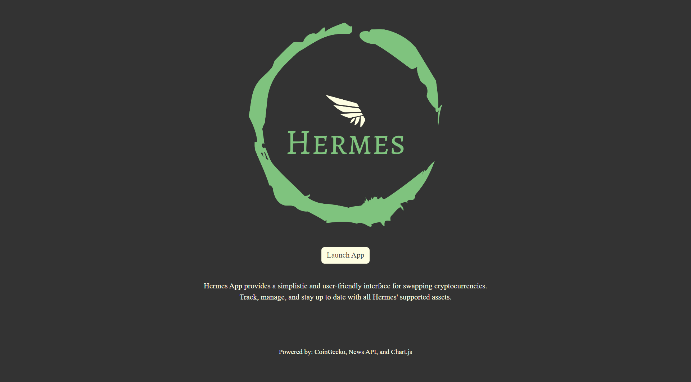
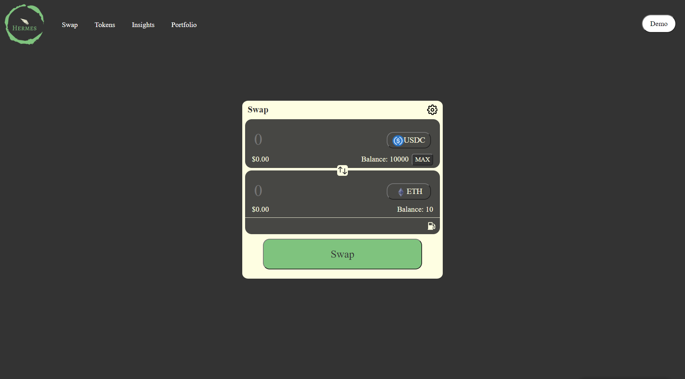
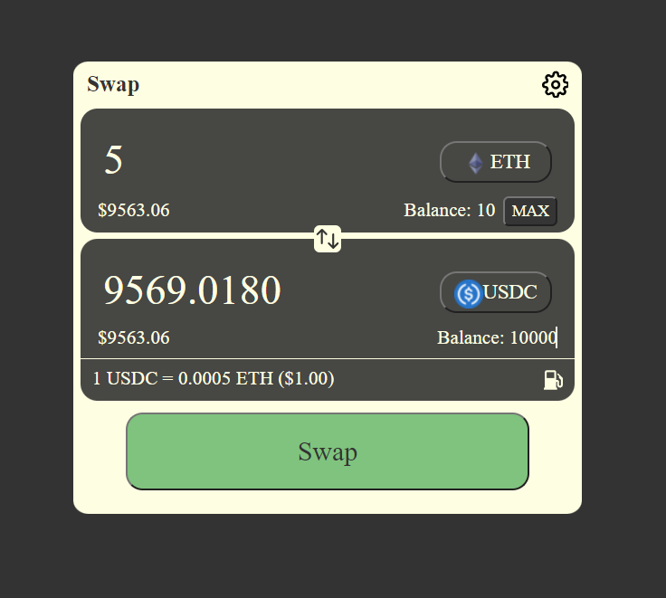
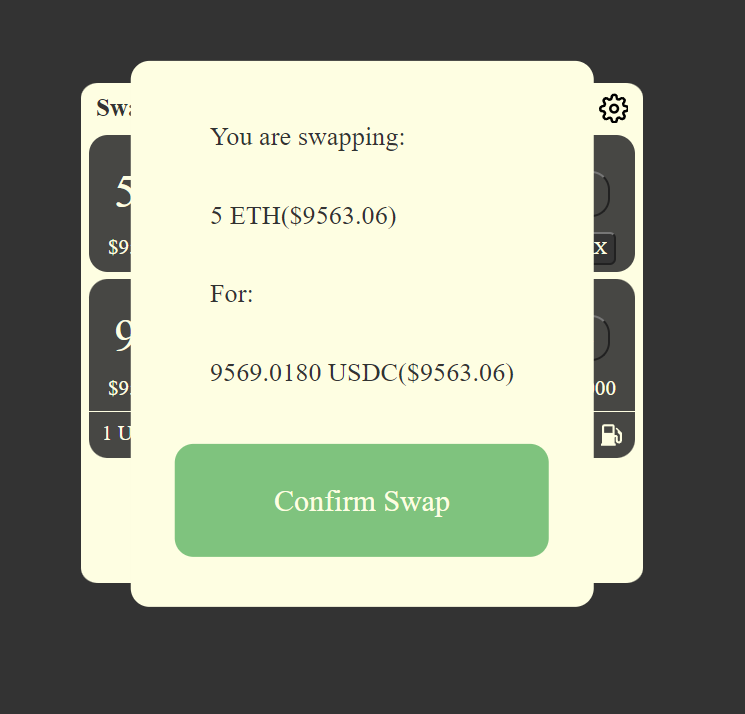
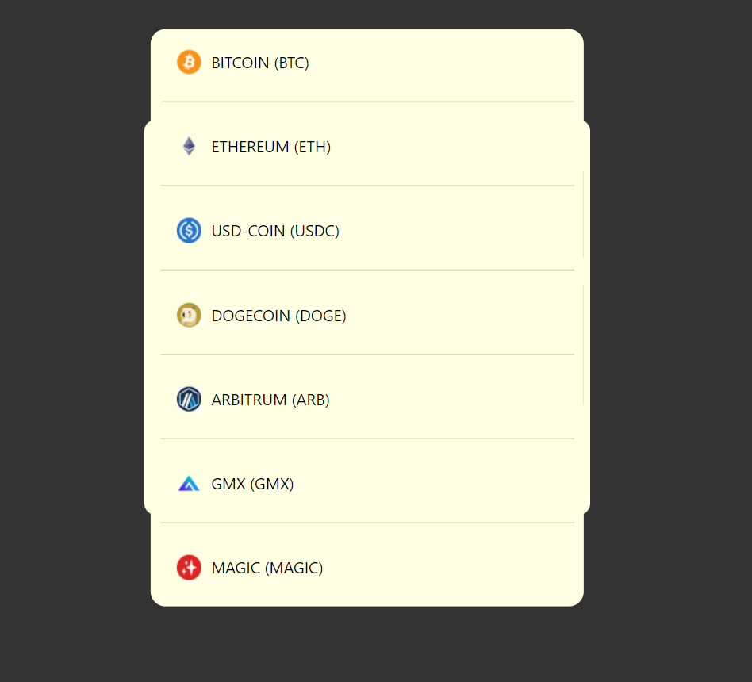
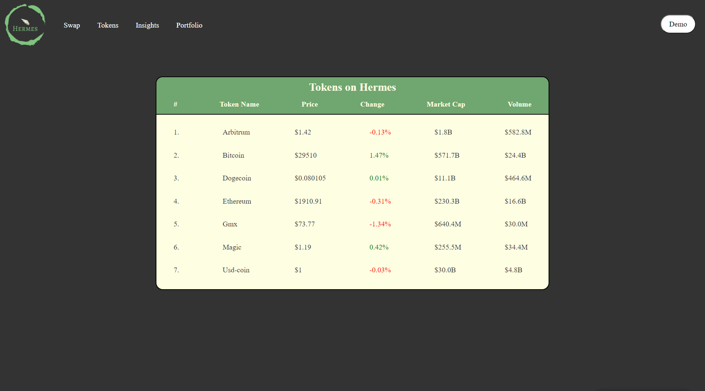
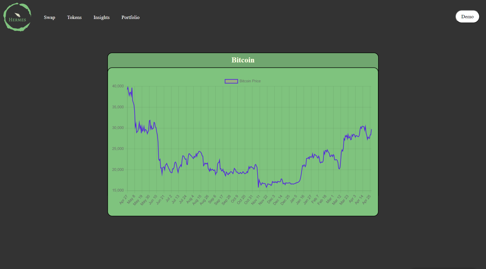
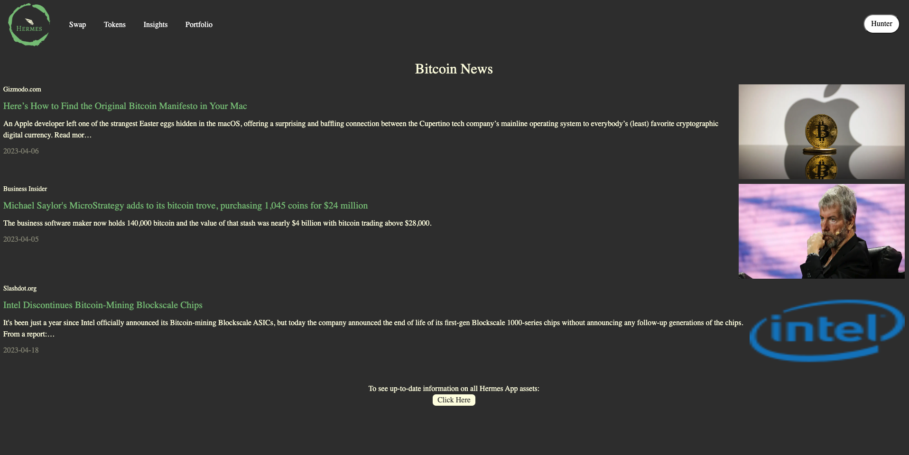
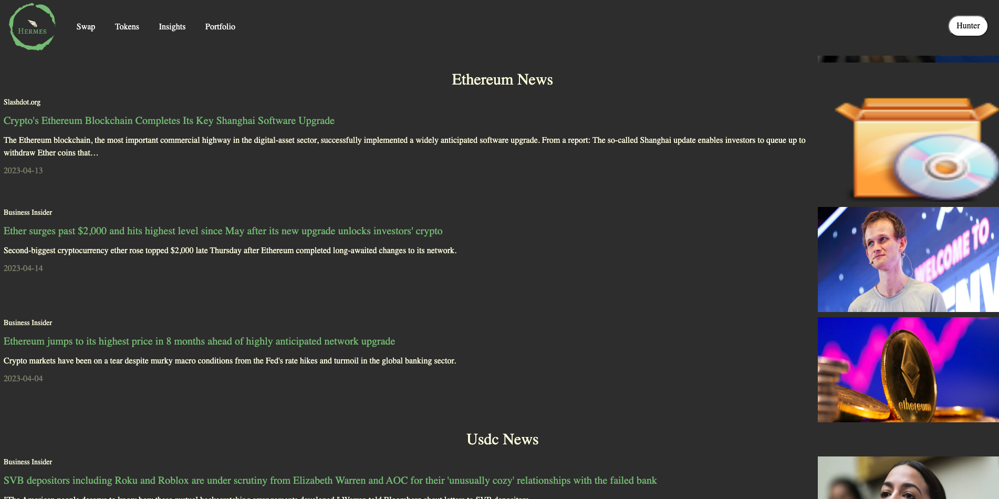
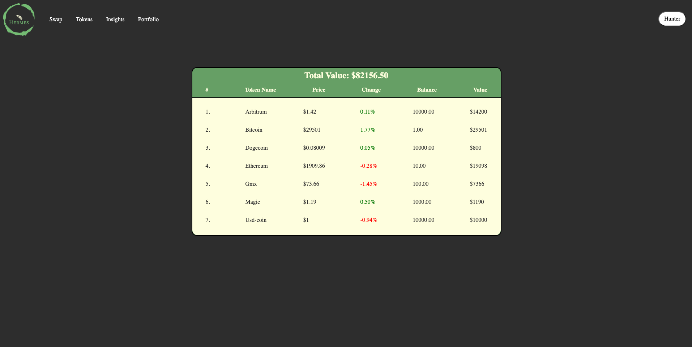

# Hermes App (Front-End Project)
Hermes App provides a simplistic and user-friendly interface for swapping cryptocurrencies.
Track, manage, and stay up to date with all Hermes' supported assets.
  
## Live Link: 🔗

Access our site at [App.Hermes.com](urlHere)
  
## Table of Contents: 📚

* [About Hermes App](#about) 
* [Screenshots](#screen) 
* [Technologies](#tech) 
* [Approach](#approach) 
* [Status](#status) 
* [Credits](#credits)
  
## About Hermes App: 🔄📈

### <b>Swap Page:</b>
Hermes' swap interface allows users to select a cryptocurrency, and provides real-time conversion of the selected cryptocurrency to another cryptocurrency based on current market prices. It's main function is a swap feature that allows users to swap one cryptocurrency for another. Additionally, it has a "max" button that allows users to input the maximum amount of cryptocurrency they have available for trading. The script fetches market prices of Hermes' supported cryptocurrencies from the CoinGecko public API.
 
### <b>Tokens Page:</b>
The Tokens page fetches and displays the current prices, market caps, trading volumes, and price change percentages of seven cryptocurrencies (Bitcoin, Ethereum, USD Coin, Dogecoin, Arbitrum, GMX, and Magic) using the CoinGecko public API. Additionally, each token includes a modal pop-up window that displays a graph of the price history for the given cryptocurrency when the name of that cryptocurrency is clicked. The graph displays data for the past year and is created using Chart.js.
 
### <b>Insights Page:</b>
Our Insights page is used to fetch news articles related to different cryptocurrencies and display them. The code uses the News API to retrieve articles for each cryptocurrency supported by the Hermes app. For each cryptocurrency, our Insights page displays the cryptocurrency name, and then fetches articles related to that cryptocurrency. For each article, the Insights page displays the article's title, image, source, description, and publication date. The number of articles displayed is limited to three and ensures that only articles with images are displayed. The resulting webpage shows the latest news related to the selected cryptocurrencies.
 
### <b>Portfolio Page:</b>
This page fetches data from the Coingecko API to display the prices, market caps, volumes, and 24-hour changes for various cryptocurrencies. It's main functionality is to show the balance of each Hermes' supported token the user has, as well as the value of each token. It then calculates the total balance value of user-owned coins based on their current prices and displays it at the top of the page. However, it only displays this information if the user is logged in. If they are not logged in, an alert message appears instructing them to log in to view their portfolio. 
### <b>Account Login:</b>
The account button in the top right of each Hermes' page allows users to create an account, log in, and view a portfolio of various cryptocurrency assets. The account feature uses localStorage to store user data and tracks whether a user is logged in or not. Overall, the account feature provides a basic authentication and portfolio display functionality for the user-friendly cryptocurrency investment application.
  
## Screenshots: 📷

### <b>Home:</b> 
</img>

### <b>Swap:</b> 
</img>

### <b>Swap - Trading:</b> 
</img>

### <b>Swap - Confirm Swap:</b> 
</img>

### <b>Swap - Change Asset Button & Modal Pop-up:</b> 
</img>

### <b>Tokens:</b> 
</img>

### <b>Tokens Charts:</b> 
</img>

### <b>Insights:</b> 
</img>
</img>
### <b>Porfolio:</b> 
</img>
### <b>Account:</b> 
</img>
</img>

  
## Technologies: 💻

- JavaScript
- HTML 
- CSS (FlexBox)
- Database: <a class="apiLink" href="https://www.chartjs.org/docs/latest/"> Chart.js</a> 
- APIs: <a class="apiLink" href="https://www.coingecko.com/en/api/documentation">CoinGecko </a>(prices & price history) and <a class="apiLink" href="https://newsapi.org/docs">News API</a> (top news articles)
  
## Approach: 💭

<b>Hunter:</b> 
My approach for our front-end project was to create a website that would be useful to many people. I think that we accomplished this goal in the sense that, through the use of our app, anyone can get experience in trading crypto without the risk of losing their hard-earned assets. 
 
I wanted to make sure that our site was consistent in its styling across all pages. This was accomplished by creating an initial CSS file which contained the basic styling for the navbar and content section, which was linked to every HTML page. 
 
With a basic template for all of our HTML pages complete, we were able to split up tasks efficiently and create pull requests with minimal merge conflicts.   
<b>Ethan:</b> 
As someone who is very passionate about Decentralized Finance and the future that cryptocurrencies can create, I was highly motivated by this project. Hunter and I collaborated well and partitioned tasks efficiently. This made the building process smooth, fast, and clean.  
Throughout this project, my main focus was to incorporate accurate trading conversions between cryptocurrencies and price charts for each token. Beyond this, I ensured a mutual styling theme between pages with attention to small details and mobile friendliness.  Hunter and I both leveraged each other's strengths to create a beginner-friendly (fake money) and realistic cryptocurrency application. 

  
## Status: 📶

Hermes App is in beta stage of development. The app uses "fake money", however the asset swapping, price data, charts, news, and portfolio tracker are all an accurate representation of trading, tracking, and managing cryptocurrency assets.  This was a 10-day front-end project built by Hunter and Ethan during week six and week seven of DigitalCrafts Bootcamp. We hope you enjoy, and good luck trading! 
  
## Credits: 🙌

### Contributors: 
<a href="">Hunter Atkins</a> & <a href="https://www.linkedin.com/in/ethan-lehman-444b68220/">Ethan Lehman</a> 
</img>
</img>
 
### Powered by:  
<a class="apiLink" href="https://www.coingecko.com/en/api/documentation">CoinGecko, </a><a class="apiLink" href="https://newsapi.org/docs">News API, </a>and<a class="apiLink" href="https://www.chartjs.org/docs/latest/"> Chart.js</a>
